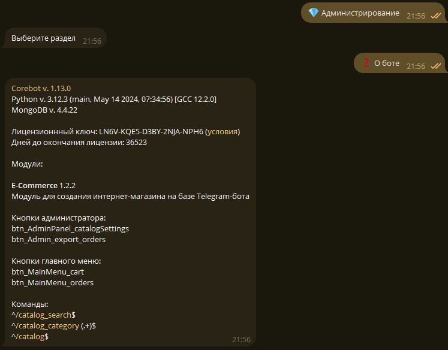

Корбот - это серверное контейнеризованное приложение, которое позволяет расширять свои функции сторонними модулями. Мы в Синвеб создали не только движок, но и написали уже десятки модулей и делимся приёмами, как их создавать, на [официальном сайте Корбота](https://corebot.ru/?utm_source=srgsemenoff_su_product)

Я разработал Корбот на <b>Python</b> с использованием библиотеки pyTelegramBotApi. Я решил взять эту библиотеку, чтобы не решать вопросы обёртки API и моделей данных сущеностей Telegram, а передать эту работу сообществу. Впрочем, это не спасло меня от множества других задач, для которых, впрочем, Корбот и оказался максимально полезен. Я сейчас говорю о лимитах API Telegram, истинной, а не формальной асинхронности и модели работы с учётом приоритетов. Благодаря этим деталям даже при высокой интенсивности отправки сообщений от бота пользователям (десятки в секунду) клиенты получают приемлемую отзывчивость системы и не ждут, когда их запрос наконец обработается и бот соизволит прислать ответ.

В этом проекте я использую <b>MongoDB</b>. Это означает, что абсолютно каждая установка разворачивает экземпляр этой СУБД. Столь экзотический выбор следует из главного преимущества этой технологии: "данные - и есть схема". MongoDB позволяет не фиксировать схему данных и работать с полностью динамическими записями. Это выглядит диковато с точки зрения традиционных проектов, однако именно это позволило поставить эффективный процесс обновления работающих экземпляров, в том числе клиентских, без миграций баз данных и конфликтов схем, которые неизбежно происходят в реляционных базах данных при таких сценариях. Как приятный бонус - это даёт возможность безудержно расширять и переделывать фичи и уделять обратной совместимости самый минимум ресурсов - после обновлений всё просто берёт и работает.

Корбот работает на <b>Docker Compose</b> и поставляется с автоматическим установщиком, который позволяет установить экземпляр Корбота даже тому пользователю, который впервые видит серверную ОС и никогда раньше не пользовался терминалом. Корбот успешно ставится и работает на самой минимальной VPS с 1 ГБ ОП и 1 ядром ЦП, но, если нагрузка предстоит высокая, этого вряд ли хватит.

Это мой первый продукт с коммерческой лицензией, которую может приобрести любой желающий по фиксированной, абсолютно демократичной цене.

Подробнее об этом продукте мы с коллегами рассказываем на [сайте](https://corebot.ru/docs/?utm_source=srgsemenoff_su_product) - пишем, что Корбот умеет, как его установить, запустить и настроить.