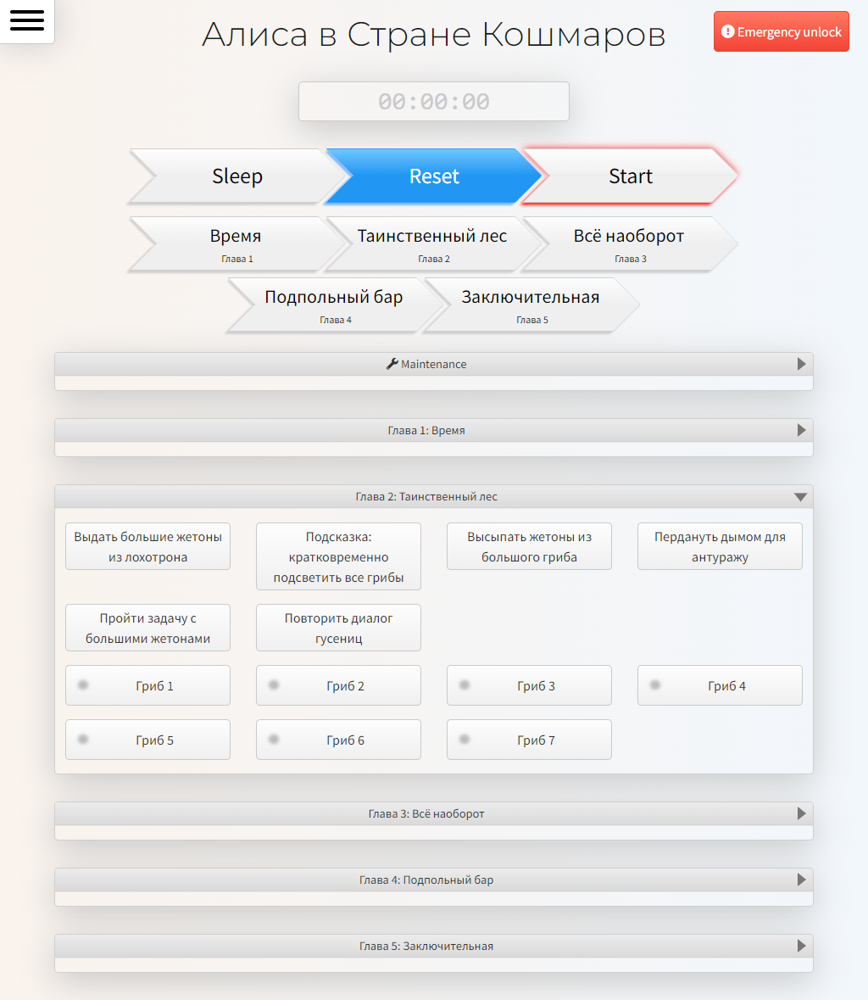

Protobarsuk - это программная экосистема для автоматического и ручного управления интерактивным помещением: квест-румом, выставкой, иммерсивной постановкой.

Это набор приложений, предназначенный в первую очередь для неттопов Intel NUC и аналогичных компьютеров под управлением ОС Windows. Система Протобарсук:
- имеет на борту специально разработанный MQTT-совместимый брокер сообщений
- предоставляет операторам удобную панель управления
- позволяет писать простые скриптовые сценарии взаимодействия с устройствами
- предоставляет удобный фреймворк для написания сложных сцераниев
- содержит многоканальный звуковой движок
- содержит универсальный медиаплеер для множества мониторов

Ядро системы - <b>Protobarsuk Core</b> - набор приложений, созданных на платформе .NET Core и классическом .NET. Я выбрал эти платформы в первую очередь из-за стабильно работающей, надёжной и максимально удобной модели многопоточности. Благодаря тщательно проработанной многопоточности в Протобарсуке вся работа с железом, которого в интерактивных помещениях часто очень много, происходит в режиме реального времени с высокой степенью надёжности. Обработка сигналов от устройств подразумевает сложные сценарии взаимодействия как с участниками (зрителями, игроками и операторами), так и между самими устройствами, а также работу с состоянием системы из множества узлов. Выполнение фрагментов сценария в Протобарсуке может происходить на любом количестве узлов (компьютеров), благодаря чему помещение, на котором работает система, может быть как небольшой комнатой, так и целым заводом с несколькими корпусами.

На основе открытых разработок я создал надёжный MQTT-брокер с особыми функциями хранения состояния и очереди сообщений, чтобы ничто не ломалось в самый ответственный момент. Этот брокер входит в <b>Protobarsuk Core</b>.

<b>Protobarsuk Core</b> ведёт самодиагностику и мониторинг узлов и железа в реальном времени.

<b>Protobarsuk Core</b> также содержит Lua-движок, на котором можно разрабатывать несложные однопоточные синхронные сценарии работы с устройствами, что покрывает 80% типовых задач. Для более сложных задач можно использовать <b>Protobarsuk Scenario</b> - фреймворк для многопоточных асинхронных приложений.

Звуковой движок <b>Protobarsuk Dispatcher</b> поддерживает одновременную работу до 8 многоканальных звуковых карт с суммарным количеством каналов до 64. Если нужно больше, достаточно просто добавить ещё один или несколько узлов и развернуть на них <b>Protobarsuk Dispatcher</b>. Движок позволяет панорамировать звуковые дорожки в реальном времени - к примеру, звук может сопровождать игрока в течение всей игры на основе его местоположения, которое считывает устройство, или виртуальный экскурсовод может последовательно вести группу по всем экспонатам.

Мультиязычный веб-интерфейс оператора позволяет вести мероприятие как на объекте с помощью компьютера, планшета или телефона, так и удалённо с любого устройства. В этом интерфейсе собранно всё необходимое для работы оператора и ничего кроме этого. Приложение оператора имеет консоль для удобной отладки всей системы целиком, включая железо.

Автономное десктопное приложение <b>Protobarsuk Portholes</b> работает как плеер видео и изображений, управляемый <b>Protobarsuk Core</b>. Поддерживает работу с произвольным количеством мониторов, подключённых к одному узлу. <b>Protobarsuk Portholes</b> может работать на одном узле с <b>Protobarsuk Dispatcher</b> и проигрывать звук одновременно на одной и той же звуковой карте.

Система может работать с интерфейсными приложениями на планшетах Android и десктопными приложениями в формате kiosk во внутренней сети.

Все приложения экосистемы Протобарсук можно развернуть на одной машине, например, на ноутбуке ведущего.

На этой системе созданы десятки квест-румов в России, Европе и США, а также флагманские проекты МСК2048 в Москве и Ulysses Spaceship в Барселоне, Испания. В большинстве этих проектов принимал участие я сам.