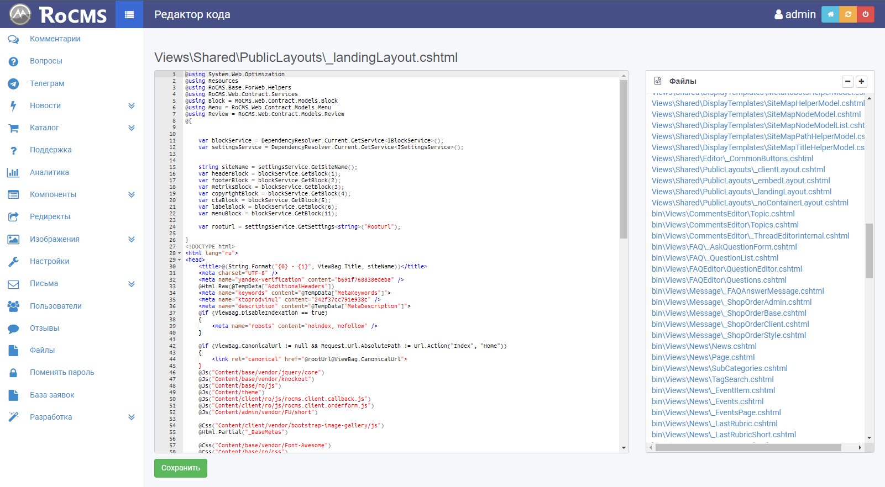

Модульная CMS на платформе ASP.NET MVC, которая была очень популярна в энтерпрайз-разработке в былые годы. При проектировании и разработке этой CMS моими главными приоритетами были:
- SEO-friendly из коробки
- Максимальное удобство взаимодействия с админкой
- Ускорение серверного рендеринга настолько, насколько это возможно

Этот проект стал ответом на страдания, которые я наблюдал у пользователей и разработчиков, имевших дело с CMS 1С-Битрикс, WordPress, Drupal, Joomla.

Мы с командой реализовали нетипичный для CMS подход: все операции с базой данных (MS SQL) происходят через вызов хранимых процедур БД. Благодаря этому, а также JIT-компилятору платформы .NET, быстродействие сайтов, созданных на этой CMS, было значительно выше, чем у сайтов на стеке PHP/MySQL актуальных на тот момент версий. Вполне вероятно, что это до сих пор так.

Фронтенд админки RoCMS написан на KnockoutJS, предшественнике более современных React, Vue, Angular. Внешний вид основан на Bootstrap 3.

CMS работает под управлением веб-сервера IIS на серверных ОС Windows.

Обновления безопасности всего технологического стека приходят вместе с автоматческими обновлениями Windows Server, так что вполне справедливо утверждение, что в сценариях использования RoCMS моими клиентами этот стек намного более безопасен, чем Linux/PHP/MySQL, который требует ручного управления обновлениями. Да и "security through obscurity" никто не отменял 8).

Поддержка RoCMS прекращена в 2019 году в связи с тем, что Microsoft похоронили классический .NET и shared-хостинги постепенно от него стали отказываться. В таких реалиях дальнейшее развитие проекта оказалось лишено смысла. Некоторые идеи RoCMS легли в основу движка <a href="/products/corebot.html">Корбот</a>. 

С прекращением поддержки RoCMS я решил, что больше нет смысла держать внутренности проекта закрытыми. В тот момент исходный код RoCMS стал доступен на <a href="https://github.com/synweb/rocms" target="_blank" rel="nofollow">GitHub</a>.