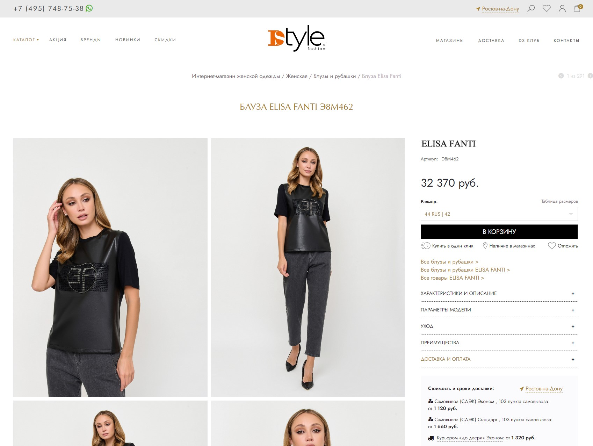
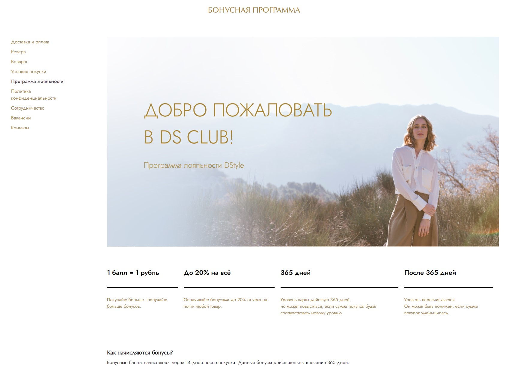
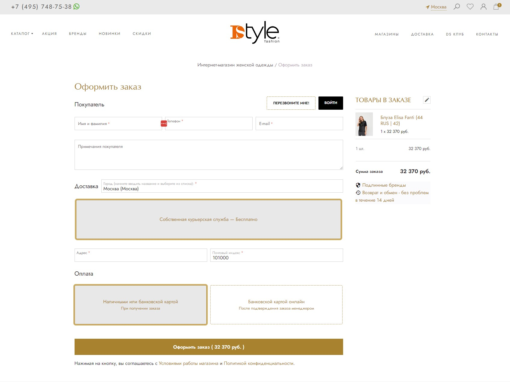

Моя команда ведёт техническую сторону интернет-продаж сети, а именно:
- сайт dstylefashion.ru и SEO-продвижение сайта
- мобильные приложения DStyle: нативные клиенты и бэкенд
- серверное ПО, которое обеспечивает взаимодействие сайта, бэкенда мобильных приложений и сервисов организации: CRM, 1С, Zabbix, система лояльности и прочее ПО

Сайт выполнен на CMS CS-Cart. Интеграционные сервисы, серверные скрипты и бэкенд мобильных приложений - на Python.

На сайте сеть магазинов размещает информацию о десятках тысяч товаров, которые доступны к заказу через интернет и присутствуют в разных торговых точках. Данные о доступности и наличии товаров обновляются непрерывно.

Примечательным техническим решением здесь является то, что бэкенд МП получает данные напрямую из БД CS-Cart. Поддержка работоспособности такой схемы при периодических обновлениях CMS сопряжена с некоторыми страданиями для всех участников процесса, но, полагаю, результат стоит свеч: пользователь МП видит гарантированно те же данные, что и посетитель сайта, ему доступны те же функции и работают они таким же образом.