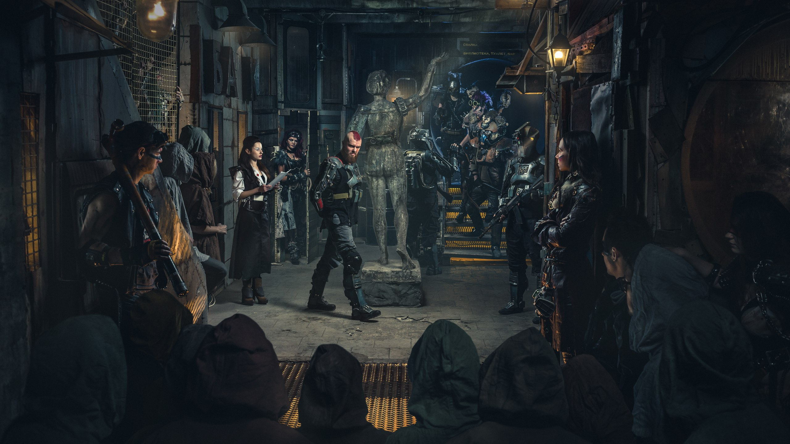
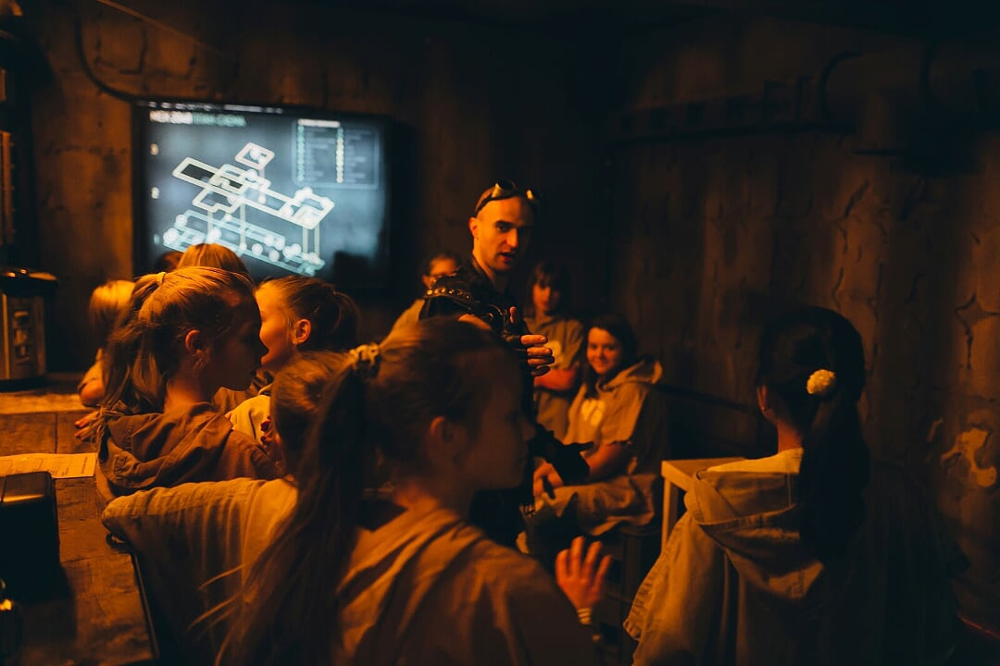
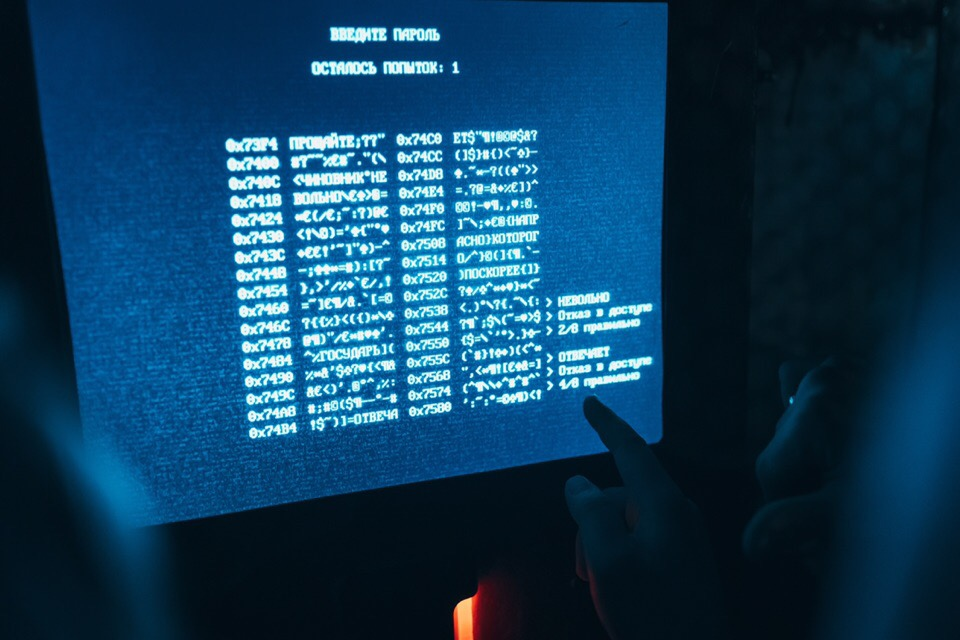
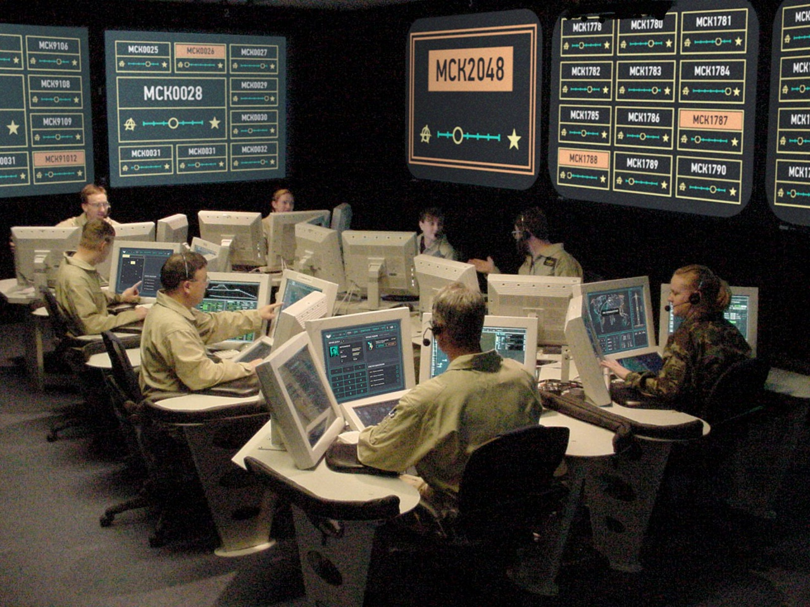
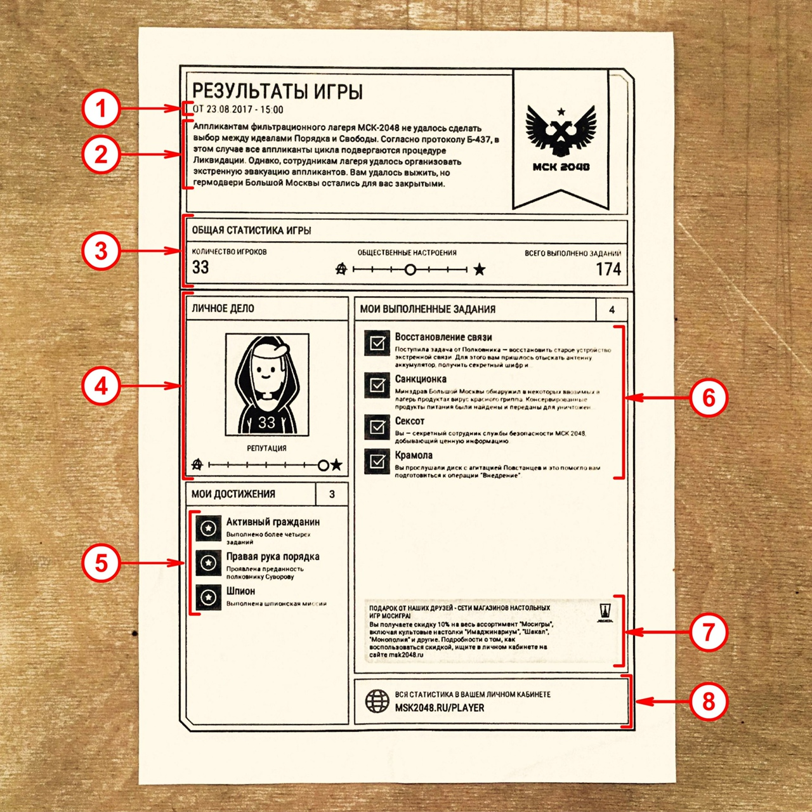
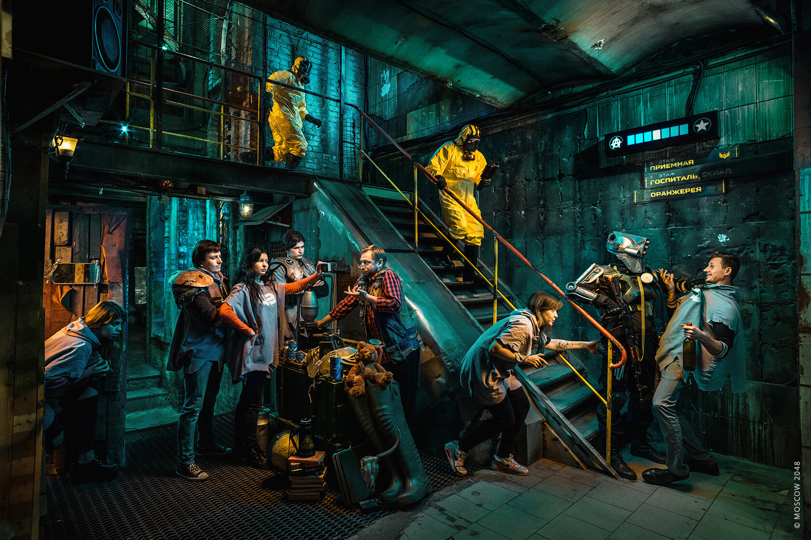
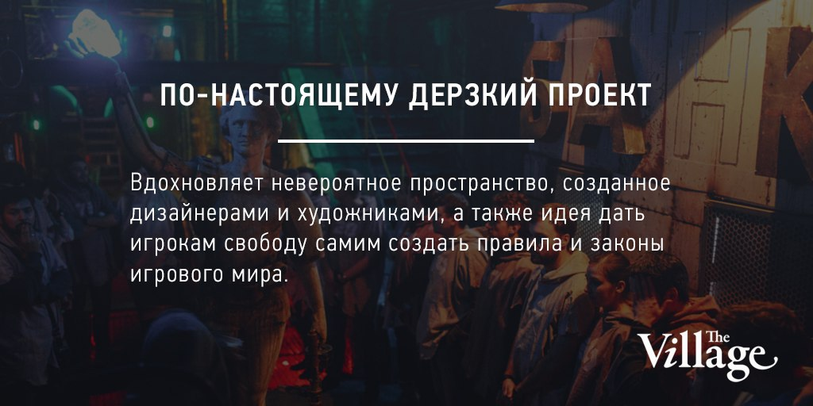
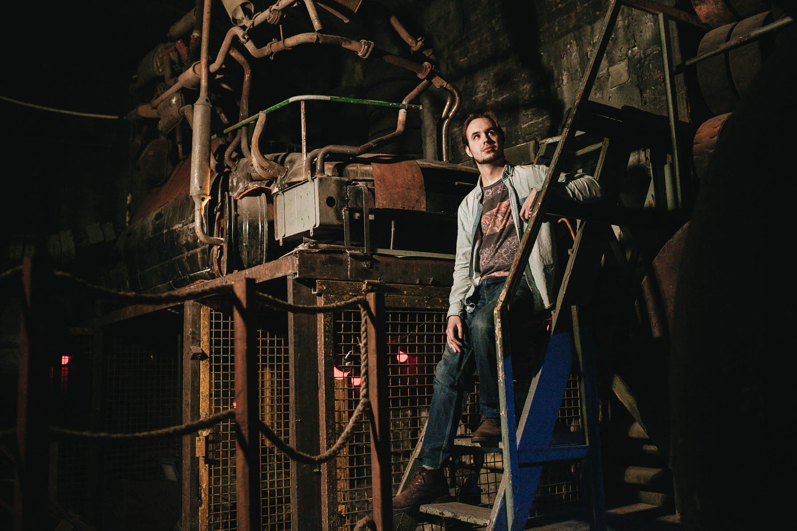

В 2015 году мне посчастливилось вести разработку одного и самых эффектных в моей карьере проектов. МСК 2048 - это иммерсивный РПГ-спектакль, напичканный интерактивной электроникой. Это автономные системы, датчики, устройства с индикаторами, терминалы и мини-игры на локации площадью 1 500 м².

Под капотом - механика самой настоящей RPG с персонажами, квестами и наградами. Можно даже получать экспу, качаться и зарабатывать репутацию. И всё это с живыми актёрами-NPC.

Выполняя бесчисленное количество квестов, игроки знакомятся с лором постапокалиптического мира и влияют на его судьбу.

Игровая механика спроектирована нелинейно - действия игроков влияют на показатели, которые постепенно подводят игру к одному из множества финалов.

Ну а операторы всё видят и незримо корректируют игровой процесс, если это нужно.

В самом конце игрок получает бумажный отчёт о его достижениях.

Все "железные" устройства связаны с терминалами, которые далее взамодействуют с центральным узлом. Я вряд ли ошибусь, если скажу, что по количеству девайсов с МСК 2048 не сравнится ни один квест и ни один арт-объект в РФ. За рубежом - есть один... Тоже с моим участием :).

Все терминалы - на Windows 7 и Windows XP, центральный узел - на Windows Server 2012. Всё написано на C#, интерфейсы свёрстаны на WPF, а общается всё по SOAP. Вся эта схема показывает исключительную надёжность с момента запуска (декабрь 2015) и практически не требует никакого обслуживания.

Премного благодарен <a href="https://t.me/desigrrr" target="_blank" rel="nofollow">Саше</a> и <a href="https://t.me/stanislavakimov" target="_blank" rel="nofollow">Стасу</a> за то, что доверили мне вести разработку этого гигантского шедевра. Не без труда, но всё получилось.

