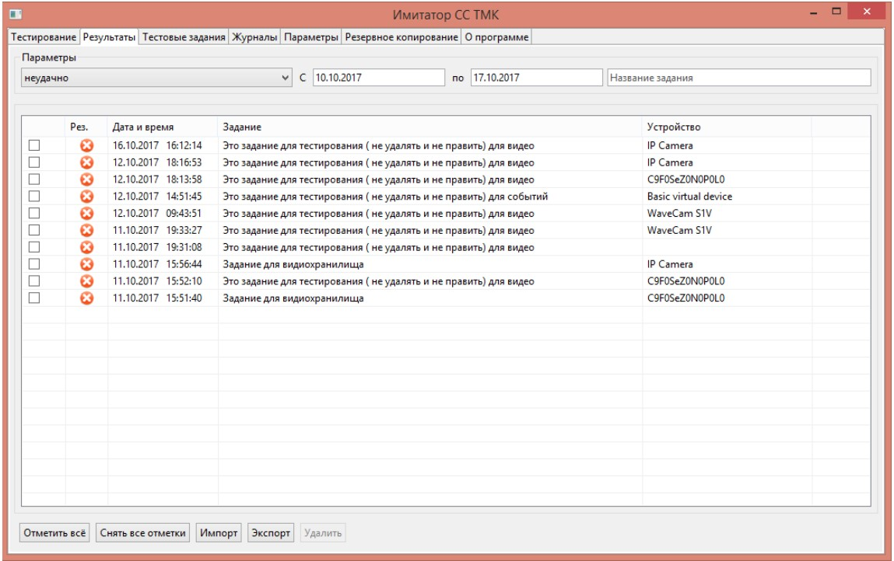

В разгар пандемии ковида ко мне обратилась компания Скан-Мастер с просьбой написать необычное приложение для их интроскопов.

Интроскоп - это установка, с помощью которой сотрудники транспортной безопасности в метро, вокзалах и аэропортах "просвечивают" багаж пассажиров и проверяют его на предмет запрещённых или опасных предметов. В 2020 году Минтранс РФ выпустил постановление, обязывающее все компании, которые устанавливают интроскопы на объектах транспорта, подключать их к только что созданной "системе сбора результатов технического мониторинга и контроля объектов транспортной инфраструктуры". Система разработана ФСБ РФ и, как оказалось, славится своей непрозрачностью, запутанностью и плохой документацией, что в скором времени добавит мне седых волос.

Короче говоря, стояла задача разработать ПО, которое будет в автоматическом режиме оправлять изображения, которые фиксирует интроскоп. ПО должно поднимать сервер, совместимый с протоколом ONVIF, и работать со всеми интроскопами производителя L3. А ещё оно должно поддерживать Windows XP, что на 2020 год было неожиданной задачей.

Документация и технические описания того, что мне предстояло создать, вызывали больше вопросов, чем решали, но в какой-то момент заказчик смог организовать доступ к ПО "Имитатор СС ТМК". Это волшебная программа, которая имитирует деятельность той самой системы с длинным названием и без особых подробностей говорит, прошло ПО тестирование или нет.

Как и следовало ожидать, ясности по спецификации протокола передачи данных эта программа не внесла, однако она перевела задачу в плоскость реверс-инженерии, это уже то, с чем можно работать.

В итоге протокол удалось изучить и воссоздать, и через некоторое время интроскопы получили программу, которая открыла им путь к сертификации технических средств транспортной безопасности. На сегодняшний день интроскопы с этим ПО работают в аэропортах и воказалах России, а самый первый экземпляр всё ещё стоит на первом этаже Центра международной торговли на Краснопресненской набережной.

